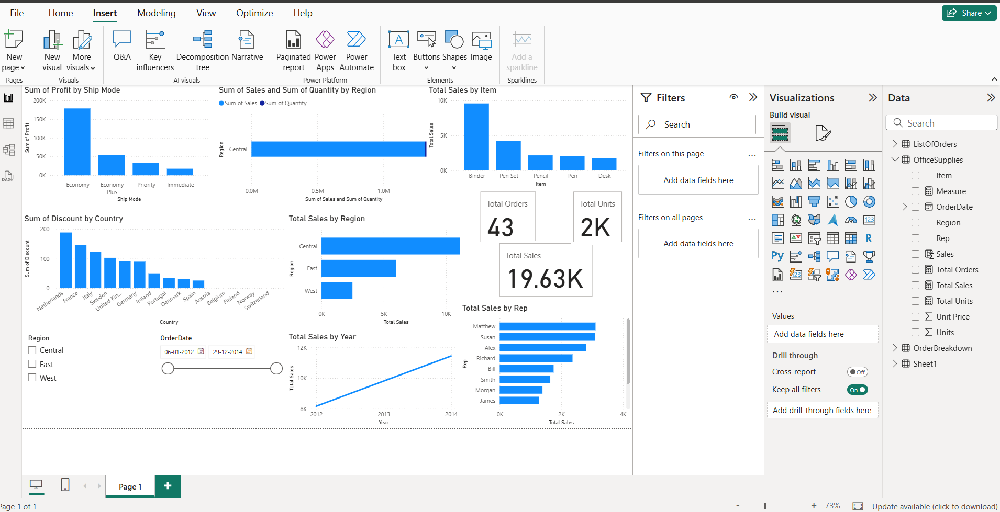
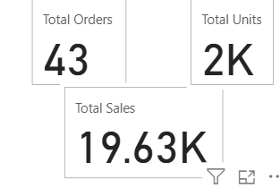
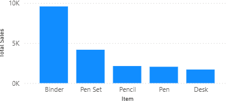
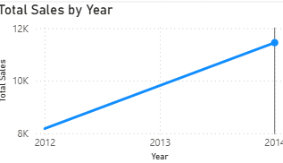

# Power BI Office Supplies Analysis 📊

## 📌 Project Overview
This project analyzes office supplies sales data using Power BI to uncover insights related to revenue, sales trends, and product performance.

---

## 🖼️ Dashboard Overview

---

## 📊 Key Metrics

**Metrics Included:**
- Total Orders
- Total Units Sold
- Total Sales Revenue

---

## 💰 Revenue by Product

**Insight:**
- Binders generate the highest revenue.
- Pen Sets and Pencils follow as mid-performing products.

---

## 📈 Sales Trend Over Time

**Insight:**
- Sales show a steady upward trend from 2012 to 2014, indicating consistent business growth.

---

## 🛠 Tools Used
- Power BI Desktop
- Power Query
- DAX

---

## 📂 Files Included
- `PowerBI_OfficeSupplies_Project.pbix`
- Dashboard screenshots
- README documentation
